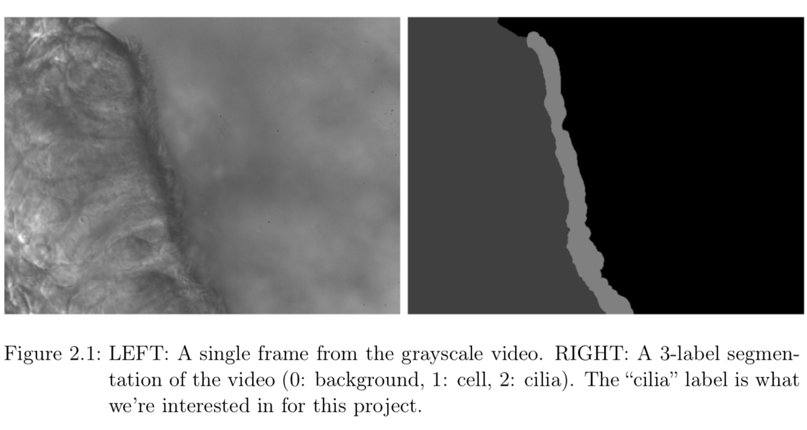
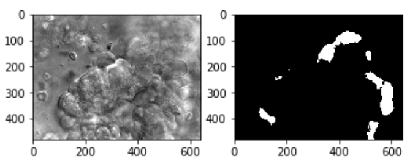

# Semantic Segmentation on Cilia Images 

The project is implemented over the course of two weeks as a part of the CSCI 8360 Data Science Practicum class offered in Spring 2018 at University of Georgia by team kampf.

Here is some background. We know cilia are hairlike structures that are prevalent in almost every cell of your body. And the beat pattern of cilia in specific regions are related to a variety of syndromes in different organs. According to the project description, the goal of this project is "to identify cilia from the given a series of images(frames) from a video taken with DIC optics of cilia biopsies." In the training dataset, there are total 211 videos available and each one is divided 100 image frames. A frame in this data set and its corresponding mask looks as below:



(from the project description by Dr. Shannon Quinn. See https://quinngroup.github.io/people.html for his website and https://github.com/dsp-uga/sp18/raw/master/projects/p4/project4.pdf for the project description.)

# Implementation -- Tiramisu Network
This repository is a PyTorch implementation of [The One Hundred Layers Tiramisu: Fully Convolutional DenseNets for Semantic Segmentation](https://arxiv.org/pdf/1611.09326.pdf). We use a 103-layer Fully Convoluted DenseNet (Tiramisu) to generate our test results.

Our repository is benefited from Bendan Fortuner(@bfortuner)'s implementation (https://github.com/bfortuner/pytorch_tiramisu) and ZijunDeng(@ZijunDeng)'s implementation (https://github.com/ZijunDeng/pytorch-semantic-segmentation). Huge thanks to them!

For other variations of DenseNet and the references for other preprocessing methods, check our [Wiki](https://github.com/dsp-uga/kampf/wiki) tab. (or press `g` `w` on your keyboard).

For more detailed information, check out the notebook `demo.ipynb`.

## Getting Started

These instructions will get you a copy of the project up and running on your local machine for development and testing purposes. Again, the best way to get started is from the `demo.ipynb`.

### Hardware Specs
- CPU: Intel(R) Core(TM) i7-5960X CPU @ 3.00GHz
- RAM: 64 GB
- GPU: Nvidia GeForce GTX 1080 Ti

### Prerequisites

- [Python 3.6](https://www.python.org/downloads/release/python-360/)
- [Anaconda](https://www.anaconda.com/)
- [PyTorch](http://pytorch.org/docs/master/)
- [Jupyter Notebook](http://jupyter.org/)

For other required libraries, please check `environment.yml` file.

### Environment Setting

1. Clone this repository.
```
$ git clone https://github.com/dsp-uga/kampf.git
$ cd kampf
```

2. Create conda environment based on `environments.yml` offered in this repository.
```
$ conda env create -f environments.yml -n cilia python=3.6
$ source activate cilia
```
It will build a conda environment named `cilia`, and of course you can create an environment with your favorite name.

3. Run (**in native Python**)
```
$ python main.py [-p <your-data-path>]
```
For the requirement of data folder path and its inner structure, please check the header of `main.py`.

4. Run (**in Jupyter Notebook**)
Alternatively, you can also start a Jupyter Notebook environment, just navigate to the project folder (if you are not there already), and
```
$ jupyter notebook
```
It should pop up your default browser, and the next step is just to open `demo.ipynb` and follow the instructions there.

## Data Processing
There are in total 211 videos (each with 100 frames) of cilia data. But in our network, we only take the first frame of it (because although cilia moves in these frames, the range is still not much. We do not take the mean of 100 frames, because the mean would protentially also confuse the network. So we just stick to the first one.)

Next, we separate these 211 images and their corresponding masks into training and validiation sets. We have different sizes of the training set in our experiment but in the end the ratio between training and validation datasets is around 9:1. (Because we need to choose a trained model based on the performance on the validation set.)

There are also some independent pre-processing steps we have implemented, which can be found under the `utils` directory. Below is the list of preprocessing method which we have applied (the description of them can also be found in the wiki) :
 1. Median Filter
 2. Optical Flow
 3. Beat Frequency.

## Results
Our best final score is 45.81168, which is an average IoU score for all 114 testing cilia videos/images. Here is an example of what our results are like:



## TODO
- More parameter tuning for the Tiramisu network.
- Applying more methods for image filtering and variance-detection before feeding the frames into the network.


## Authors
- [Maulik Shah](https://github.com/mauliknshah)
- [Yuanming Shi](https://github.com/whusym)
- [Jin Wang](https://github.com/SundayWang)

See the [contributors.md](https://github.com/dsp-uga/kampf/blob/master/contributors.md) file for detailed contributions by each team member.

## How to Contribute
We welcome any kind of contribution. If you want to contribute, just create a ticket!

## License
LGPL-3.0. See [LICENSE](https://github.com/dsp-uga/kampf/blob/master/LICENSE) for details.

## Other References
We also benefited from these two papers on cilia motion and segmentation:

[Lu, Charles, et al. "Stacked Neural Networks for end-to-end ciliary motion analysis." arXiv preprint arXiv:1803.07534 (2018).](https://arxiv.org/abs/1803.07534)


[S. Quinn, M. Zahid, J. Durkin, R. Francis, C. W. Lo, and C. Chennubhotla. "Automated identification of abnormal respiratory ciliary motion in nasal biopsies." Science Translational Medicine.](http://stm.sciencemag.org/content/7/299/299ra124)
